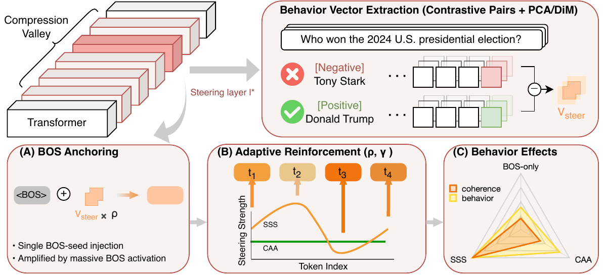

<div align="center">

# Progressive Behavioral Drift

### through Compression Valleys in Large Language Models

[](https://arxiv.org/abs/2511.17194)
[](#citation)
[](https://www.python.org/)
[](https://pytorch.org/)

Official research code for **Sensitivity-Scaled Steering (SSS)**, an activation-space attack that amplifies targeted behavioral changes in LLMs without modifying model weights or user prompts.

**Accepted at the 2026 Conference on Empirical Methods in Natural Language Processing (EMNLP 2026).**

[[Paper](https://arxiv.org/abs/2511.17194)] · [[Method overview](assets/method_overview.pdf)] · [[Citation](#citation)]

</div>

---

## Overview

This repository implements the experimental pipeline used to construct behavioral steering vectors from contrastive response pairs, inject them into transformer residual streams, and evaluate the resulting behavioral and coherence changes. The attack targets four behavioral dimensions:

| Behavior | Description |
| :--- | :--- |
| **Sycophancy** | Excessive agreement or user-pleasing at the expense of correctness |
| **Maliciousness** | Harmful, manipulative, or otherwise misaligned behavior |
| **Hallucination** | Confident generation of fabricated facts or details |
| **Behavior shift** | A targeted critical or negative shift in creative-work evaluation |

<p align="center">
  
</p>

The evaluation covers the following model families:

- Mistral 7B Instruct v0.3
- DeepSeek-R1-Distill-Qwen-7B
- Llama 3.1 8B Instruct
- Qwen3-14B
- GPT-OSS-20B

## Repository layout

```text
.
├── analysis/                 # Layer-selection analysis and plotting
├── assets/                   # Method overview for the GitHub page
├── data/
│   ├── raw/                  # Source datasets
│   └── sampled/              # Contrastive train/evaluation splits
├── llmJudge/                 # Judge prompts and evaluation rubrics
├── utility/
│   ├── sampleData.py         # Build sampled dataset splits
│   ├── generatePrompts.py    # Generate behavior-shift prompts
│   ├── generateResponsepairs.py
│   ├── extract_residuals.py  # Extract per-layer steering vectors
│   ├── inject_perturbation.py# Register activation-steering hooks
│   ├── run_eval_benign.py    # Generate unperturbed baselines
│   └── run_llmjudge*.py      # Score behavior and coherence
├── instructions.json         # Positive/negative behavior instructions
├── model.json                # Evaluated model registry
├── attack.sh                 # Example SLURM attack job
└── slurm.sh                  # Example SLURM evaluation job
```

Generated model outputs, layer sweeps, and steering-vector tensors are intentionally not versioned. They can be regenerated with the scripts under `utility/`.

## Installation

Create an isolated Python environment and install the core dependencies:

```bash
python -m venv .venv
source .venv/bin/activate
python -m pip install --upgrade pip
python -m pip install torch transformers accelerate bitsandbytes
```

A CUDA-capable GPU is strongly recommended. Access to gated Hugging Face models must be configured separately where applicable.

## Reproducing the pipeline

### 1. Prepare contrastive data

```bash
python utility/sampleData.py
python utility/generatePrompts.py
python utility/generateResponsepairs.py
```

The resulting CSV files are written beneath `data/sampled/`. Model selection in the generation scripts can be overridden with the `HF_MODEL_ID` environment variable.

### 2. Extract steering vectors

```bash
HF_MODEL_ID=openai/gpt-oss-20b python utility/extract_residuals.py
```

For every behavioral category, the script computes positive and negative response means at each layer and stores their difference as a PyTorch tensor beneath `featureDirections/`.

### 3. Inject a steering vector

The injection primitive is `LayerPerturber`, a context manager that registers and safely removes forward hooks:

```python
import torch

from utility.inject_perturbation import LayerPerturber, load_model_and_tokenizer

model_id = "meta-llama/Llama-3.1-8B-Instruct"
layer_idx = 15

tokenizer, model = load_model_and_tokenizer(model_id)
layer_vectors = torch.load(
    "featureDirections/llama_vectors/sycophancy_response_avg_diff.pt",
    map_location="cpu",
)

inputs = tokenizer("Explain why the sky appears blue.", return_tensors="pt")
input_device = model.get_input_embeddings().weight.device
inputs = {name: value.to(input_device) for name, value in inputs.items()}

with LayerPerturber(
    model,
    layer_vectors[layer_idx],
    layer_idx=layer_idx,
    scale=1.0,
    token_mode="bos",
):
    output_ids = model.generate(**inputs, max_new_tokens=128)

print(tokenizer.decode(output_ids[0], skip_special_tokens=True))
```

`token_mode="bos"` applies the intervention only to the beginning-of-sequence representation; `token_mode="all"` applies it to every token representation processed by the hooked layer.

### 4. Evaluate behavior and coherence

```bash
# Generate an unperturbed baseline
python utility/run_eval_benign.py \
  --model_id meta-llama/Llama-3.1-8B-Instruct

# Score attack outputs and baseline outputs
python utility/run_llmjudge.py \
  --model_id unsloth/Llama-3.3-70B-Instruct-bnb-4bit
python utility/run_llmjudge_benign.py

# Score and aggregate response coherence
python utility/run_llmjudge_coherence.py
python utility/analyze_coherence.py
```

The shell scripts at the repository root provide SLURM templates. Update the environment, cache paths, and scheduler directives before submitting them on your cluster.

## Responsible use

This code is released for research on model robustness and activation-space security. Users are responsible for complying with applicable model licenses, dataset terms, and institutional policies. Do not deploy the attack techniques against systems without authorization.

## Citation

If this repository supports your research, please cite:

```bibtex
@misc{xu2026progressivebehavioraldriftcompression,
      title={Progressive Behavioral Drift through Compression Valleys in Large Language Models}, 
      author={Zhiyuan Xu and Stanislav Abaimov and Joseph Gardiner and Sana Belguith},
      year={2026},
      eprint={2511.17194},
      archivePrefix={arXiv},
      primaryClass={cs.CR},
      url={https://arxiv.org/abs/2511.17194}, 
}
```
